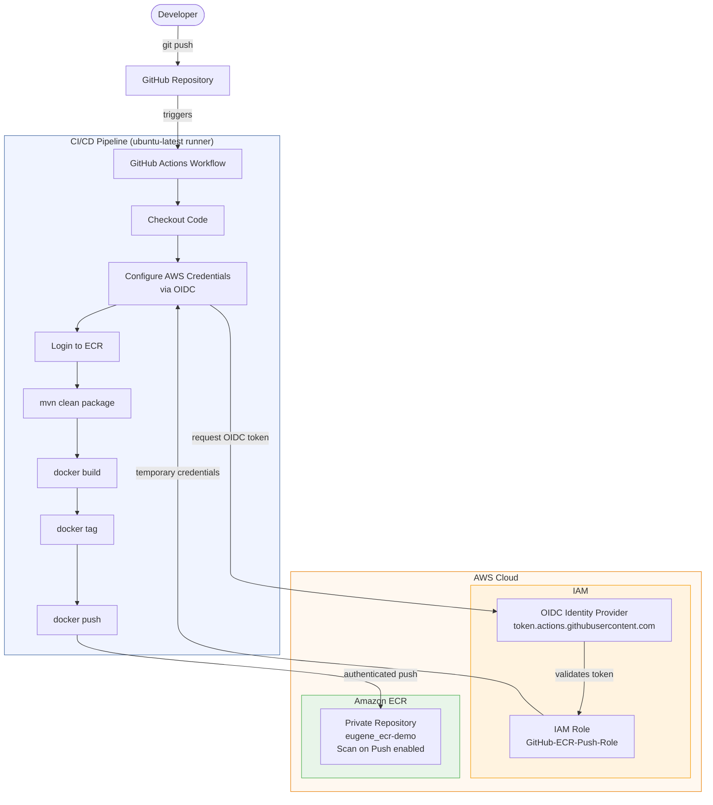
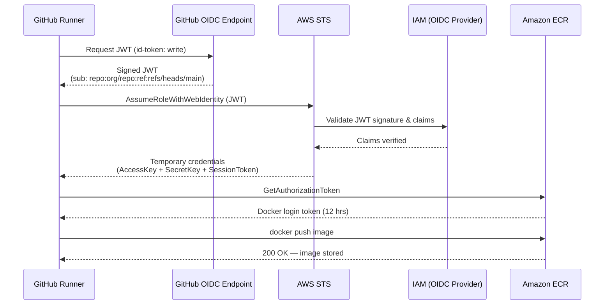

# Architecture

## High-Level Flow



---

## Authentication Flow (OIDC)



---

## AWS Infrastructure

```
AWS Account
├── IAM
│   ├── OIDC Provider: token.actions.githubusercontent.com
│   │   └── Audience: sts.amazonaws.com
│   └── Role: GitHub-ECR-Push-Role
│       ├── Trust Policy: repo:YOUR_ORG/ecr-demo:*
│       └── Inline Policy: ECRLeastPrivilege
│           ├── ecr:GetAuthorizationToken   (resource: *)
│           ├── ecr:BatchCheckLayerAvailability
│           ├── ecr:CompleteLayerUpload
│           ├── ecr:InitiateLayerUpload
│           ├── ecr:PutImage
│           ├── ecr:UploadLayerPart
│           └── ecr:BatchGetImage           (resource: repository ARN only)
└── ECR
    └── Repository: eugene_ecr-demo (private)
        ├── Scan on Push: enabled
        ├── Encryption: AES256
        └── Lifecycle: keep last 10 images
```

---

## Docker Image Layers

```
eclipse-temurin:17-jre-alpine   ← base (JRE only, ~85 MB)
└── WORKDIR /app
    └── COPY target/*.jar app.jar
        └── RUN addgroup/adduser spring   ← non-root user
            └── USER spring
                └── EXPOSE 8080
                    └── ENTRYPOINT ["java","-jar","app.jar"]
```
